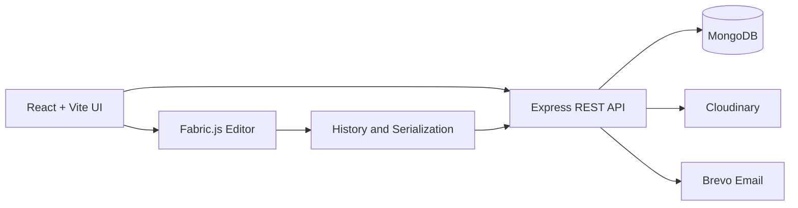

<div align="center">

# DesignFlow

### A full-stack, browser-based visual design editor powered by Fabric.js

Create social posts, marketing graphics, presentations, and personal designs with editable templates, reusable assets, professional layers, non-destructive cropping, and high-resolution export.

[](https://design-flow-ten.vercel.app/)
[](https://github.com/nitin01924/DesignFlow)


</div>


**Last updated:** 2026-08-16

**Language composition:** JavaScript (99.2%)

---

## About the project

DesignFlow is a Canva-inspired design editor built as a real full-stack application. Its editor is based on structured Fabric.js objects rather than flattened images, so text, shapes, icons, image[...]

The project focuses on professional editing behavior: intentional editing modes, atomic undo/redo history, synchronized layers, reusable asset libraries, responsive mobile controls, and reliable p[...]

## Core features

| Area | Capabilities |
| --- | --- |
| Canvas editor | Move, resize, rotate, duplicate, delete, lock, reorder, and style Fabric.js objects |
| Undo and redo | Centralized history manager, desktop shortcuts, toolbar controls, and up to 100 bounded states |
| Layers | Canvas selection sync, search, inline rename, drag reordering, visibility, locking, duplication, and deletion |
| Typography | Editable text, font family, size, weight, color, alignment, letter spacing, line height, and opacity |
| Shapes and icons | Editable vector shapes and several hundred searchable Lucide SVG icons |
| Image library | Authenticated, reusable user uploads backed by Cloudinary with search and optimized previews |
| Modern cropping | Non-destructive crop frame resizing, image panning, rule-of-thirds grid, dark overlay, apply/cancel, and history integration |
| Frames | Rectangle, rounded, circle, ellipse, triangle, hexagon, blob, phone, laptop, and browser frames with image replacement and repositioning |
| Templates | 13 editable starter templates across Social Media, Marketing, Business, and Personal categories |
| Export | PNG, JPG, and PDF with 1x, 2x, or 4x resolution options and configurable backgrounds |
| Projects | User-owned projects, save/load, composite Dashboard thumbnails, rename, and delete workflows |
| Responsive editing | Dedicated desktop controls and touch-friendly mobile toolbars, panels, and bottom sheets |
| Authentication | Registration, email verification, JWT login, protected data, and password reset email flow |

## Template workflow

Templates are structured design documents, not screenshots. Choosing a template creates a new project owned by the authenticated user and copies the template's Fabric canvas data into it. The orig[...]

Every supported object remains editable inside the normal editor:

- Text stays editable as Fabric text objects.
- Shapes and vector icons keep their style controls.
- Images retain crop and transform behavior.
- Frames retain their image source, zoom, and position metadata.
- Layer names and stacking order are preserved.
- The first Dashboard preview represents the template immediately; normal saves then use the existing project-thumbnail pipeline.

## Architecture



The application keeps responsibilities separated:

- React owns application state, panels, dialogs, and responsive UI.
- Fabric.js owns canvas objects and direct manipulation.
- A centralized serializer is shared by history and project persistence.
- The history manager records completed actions instead of every drag frame.
- Express APIs enforce authentication and project ownership.
- MongoDB stores users, projects, canvas JSON, dimensions, and asset metadata.
- Cloudinary stores user images and generated project thumbnails.
- Template browsing returns lightweight previews; full canvas data is copied only when a template is used.

## Technology stack

### Frontend

- React 19
- Fabric.js 7
- Vite 8
- Tailwind CSS 4
- React Router
- Lucide icon catalog
- jsPDF
- React Toastify
- Vercel Analytics

### Backend

- Node.js and Express 5
- MongoDB with Mongoose
- JWT authentication
- bcrypt password hashing
- Multer in-memory uploads
- Cloudinary image storage
- Brevo transactional email

## Project structure

```text
DesignFlow/
├── Frontend/
│   └── src/
│       ├── components/editor/   # Canvas, tools, history, crop, frames, layers
│       ├── components/templates/# Responsive template browser
│       ├── hooks/               # Save and export workflows
│       ├── pages/               # Auth, Dashboard, and editor pages
│       ├── services/            # API-facing services
│       └── utils/               # API, export, and thumbnail utilities
├── Backend/
│   ├── config/                  # Database and Cloudinary configuration
│   ├── controllers/             # Auth, projects, images, and templates
│   ├── data/                    # Immutable structured template catalog
│   ├── middleware/              # Authentication, errors, and uploads
│   ├── models/                  # User, Project, and ImageAsset models
│   ├── routes/                  # REST API routes
│   └── utils/                   # Email and asset helpers
├── LICENSE
└── README.md
```

## Getting started

### Prerequisites

- Node.js `^20.19.0` or `>=22.12.0`
- npm
- MongoDB database
- Cloudinary account
- Brevo account for verification and password-reset emails

### 1. Clone the repository

```bash
git clone https://github.com/nitin01924/DesignFlow.git
cd DesignFlow
```

### 2. Configure and run the backend

```bash
cd Backend
npm install
```

Create `Backend/.env`:

```env
MONGO_URI=your_mongodb_connection_string
JWT_SECRET=your_long_random_jwt_secret

CLOUDINARY_CLOUD_NAME=your_cloudinary_cloud_name
CLOUDINARY_API_KEY=your_cloudinary_api_key
CLOUDINARY_API_SECRET=your_cloudinary_api_secret

BREVO_API_KEY=your_brevo_api_key
BREVO_SENDER_EMAIL=your_verified_sender_email
CLIENT_URL=http://localhost:5173
```

Start the API server:

```bash
npm run dev
```

The backend runs at `http://localhost:3000`.

### 3. Configure and run the frontend

Open a second terminal:

```bash
cd Frontend
npm install
```

Create `Frontend/.env`:

```env
VITE_API_URL=http://localhost:3000
```

Start the Vite development server:

```bash
npm run dev
```

Open `http://localhost:5173`.

> Do not include `/api` in `VITE_API_URL`; frontend services add the API path themselves.

## Available commands

Run these commands inside `Frontend/`:

```bash
npm run dev      # Start the development server
npm run lint     # Run ESLint
npm run build    # Create a production build
npm run preview  # Preview the production build locally
```

Run this command inside `Backend/`:

```bash
npm run dev      # Start Express with Nodemon
```

## API overview

| Route group | Purpose |
| --- | --- |
| `/api/auth` | Registration, verification, login, current user, and password reset |
| `/api/projects` | User-owned project CRUD, canvas persistence, uploads, and thumbnails |
| `/api/images` | Authenticated reusable image library |
| `/api/templates` | Public template metadata and authenticated template-to-project creation |

## Security and persistence

- Project and image-library queries are scoped to the authenticated user.
- Project ownership is checked before canvas, upload, thumbnail, rename, and delete operations.
- Passwords are hashed with bcrypt and sessions use signed JWTs.
- Uploads accept JPG, PNG, and WebP images with bounded file sizes.
- Image files are streamed from memory to Cloudinary instead of being written to the application server.
- Undo/redo history is session-only and is not stored inside project documents.
- Saved projects persist structured Fabric JSON and DesignFlow-specific metadata.

## Live application

Try DesignFlow at **[design-flow-ten.vercel.app](https://design-flow-ten.vercel.app/)**.

## Author

Built by **Nitin Kumar**.

- [GitHub](https://github.com/nitin01924)
- [LinkedIn](https://linkedin.com/in/nitin-kumar-a9609a2b2)
- [Portfolio](https://portfolio-three-steel-ps6rqrl36s.vercel.app/)
- [Email](mailto:nitin981275@gmail.com)

## License

This project is available under the [MIT License](./LICENSE).

---

<div align="center">
  Built with care to make browser-based design editing feel fast, predictable, and professional.
</div>
